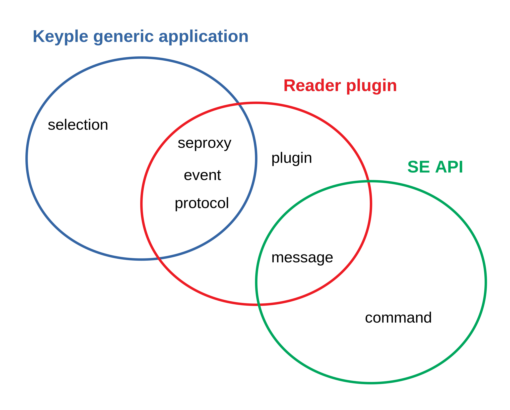
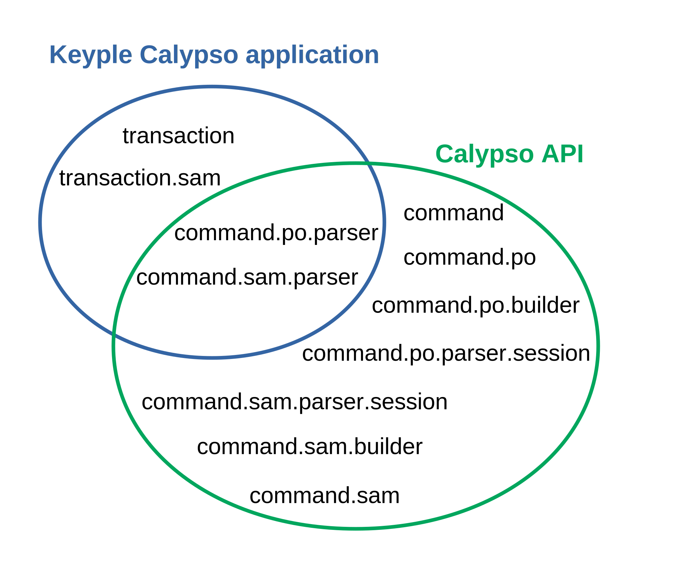

# 'Eclipse Keyple' Java implementation

This is the repository for the Java implementation of the 'Eclipse [Keyple](https://keyple.org/)' API.
(In September 2019, the C++ implementation will be hosted on https://github.com/eclipse/keyple-cpp)

## Getting started
Releases and snapshots are available from Maven central repositories.

### Cloning this project
Examples provided in this project relies on symbolic links to handle their common dependencies. (Please refer to this [file](/java/example/README.md) for more information).

Although symlink support should be provided out of the box for Unix users, **Windows users** should be aware that the git option `core.symlinks` needs to be enabled before [cloning](https://help.github.com/en/articles/cloning-a-repository) this repo. Several solutions can be considered:
- When installing git for Windows, an option `Enable symbolic links` can be choosen. If it has not been enabled and you want to set it via the installer, a reinstallation is needed
- If you do not want to reinstall git, this option can be enabled afterward via the command line `git config core.symlinks true`
- Also, the option can be enabled once only for this specific cloning operation with `git clone -c core.symlinks=true REPO_URL`

It is important to note that for this option to be actually working, the Windows user needs to have the **_SeCreateSymbolicLink_ permission**: a user with admin rights is typically granted with this permission.

### Import keyple components with Gradle

When using gradle, it is fairly simple to import Keyple components into your project. Just add the following statements to your build.gradle file :

```
repositories {
        //to import snapshots
        maven {url 'https://oss.sonatype.org/content/repositories/snapshots' }
        //to import releases
        maven { url 'https://oss.sonatype.org/content/repositories/releases' }
}

dependencies {
     //Keyple core is a mandatory library for using Keyple, in this case import the last version of keyple-java-core
    implementation group: 'org.eclipse.keyple', name: 'keyple-java-core', version: '+'

    //Import Calypso library to support Calypso Portable Object, in this case import the last version of keyple-java-calypso
    implementation group: 'org.eclipse.keyple', name: 'keyple-java-calypso', version: '+'
   
    //Import PCSC library to use a Pcsc reader, in this case import the last version of keyple-java-plugin-pcsc
    implementation group: 'org.eclipse.keyple', name: 'keyple-java-plugin-pcsc', version: '+'
    ...
}
```

## Global Architecture of Keyple


The API is currently divided in two major layers:
- The ‘Keyple Core' : a Secure Element Proxy API which allows managing SE readers in a generic way, whaterver the reader driver or environment, and for standalone or distributed solution.
- A ‘Calypso Keyple extension' : a high level Calypso Processing API allowing to operate commands with a Calypso Portable Object, and to manage a secure Calypso transaction.
Dedicated reader’s plugins have to be implemented in order to interface the SE Proxy API with the specific reader’s drivers.

## Supported platforms
- Java SE 1.6 compact2
- Android 4.4 KitKat API level 19

## keyple-java repositories structure

- Modules that are provided as artifacts
  - keyple-core: source and unit tests for the SE Proxy module (artifact : keyple-java-core)
  - keyple-calypso: source and unit tests for the Calypso library (artifact : keyple-java-calypso)
  - keyple-plugin: source and unit tests for the different plugins: smartcard.io PC/SC, Stub, Android NFC, Android OMAPI, etc.
- developer support, testing
  - example: source for Keyple implementation examples, generic or Calypso specific.
  - integration: source for the integration code (SDK).

## Keyple features and corresponding packages

Keyple features global for any Secure Element solution:

| Features                                     | Packages  |
| -------------------------------------------- |-------------|
| Selections of Secure Elements (high level API) | org.eclipse.keyple.core.**selection** |
| Management of SE readers | org.eclipse.keyple.core.**seproxy** |
| Notifications of reader plug/unplug, of SE insertion/remove<ul><li>definition of automatic selection request in case of SE insertion on an Observable Reader.</li></ul> | org.eclipse.keyple.core.seproxy.**event** |
| Communication protocols filters (setting for contactless/contacts SE Reader) | org.eclipse.keyple.core.seproxy.**protocol** |
| Reader plugins implementation support <ul><li>Utility classes providing generic processing for SE Reader Plugins</li></ul> | org.eclipse.keyple.core.seproxy.**plugin** |
| Transmition of grouped APDU commands to a SE Reader (low level API) | org.eclipse.keyple.core.seproxy.**message** |
| SE specific library implementation support <ul><li>generic API to build a SE specific commands library</li></ul> | org.eclipse.keyple.core.**command** |

Keyple features defined to support the Calypso solution:

| Features                                     | Packages  |
| -------------------------------------------- |-------------|
| Calypso Portable Object commands and secure transaction management <ul><li>high level CalypsoAPI, commands’ settings are limited to functional parameters</li><li>Calypso SAM (Secure Module) operations automatically processed</li></ul> | org.eclipse.keyple.calypso.**transaction** |
| Calypso PO responses data parsing | org.eclipse.keyple.calypso.command.**po.parser** |
| Calypso SAM responses data parsing | org.eclipse.keyple.calypso.command.**sam.parser** |
| Calypso PO & SAM commands' sets<ul><li>low level Calypso API, commands’ settings include technical parameters specific to Calypso PO revisions or Calypso SAM revisions</li></ul> | <ul><li>org.eclipse.keyple.calypso.**command**</li><li>org.eclipse.keyple.calypso.command.**po**</li><li>org.eclipse.keyple.calypso.command.**po.builder**</li><li>org.eclipse.keyple.calypso.command.**po.parser.session**</li><li>org.eclipse.keyple.calypso.command.**sam.parser.session**</li><li>org.eclipse.keyple.calypso.command.**sam.builder**</li><li>org.eclipse.keyple.calypso.command.**sam**</li></ul> |

## Keyple packages and corresponding usages
Depending on the targetting usage: implementation of a ticketing **application** (blue circle), a reader **plugin** (red circle), or a **SE library** (green circle), only specific Keyple packages must be imported.

- generic packages for any SE solution



- specific packages for Calypso



## JARs
The Eclipse Keyple Java artifacts are published on the Eclipse Keyple Project page [https://projects.eclipse.org/projects/iot.keyple/downloads] (available also on Maven).

- Keyple modules:
  - **'Keyple Core module' JAR**:  the generic API to manage Secure Element Readers and to select SE application.
  - **'Keyple Calypso Library JAR'**: the Calypso API to operate a transaction with a Calypso Portable Object.
- Keyple plugins:
  - **'Keyple PC/SC plugin JAR'**: to manage PC/SC readers on a PC environment supporting the # javax.smartcardio API
  - **'Keyple NFC Android plugin AAR'**: to operate the contactless reader of an Android Environment supporting the android.nfc API 
  - **'Keyple OMAPI Android plugin AAR'**: to operate the internal contacts readers of an Android Environment supporting the OMAPI 
  - **'Keyple "stub" plugin JAR'**: plugin to simulate the presence of fake readers with or without fake cards
  - **'Keyple "Remote SE" plugin JARs'**: plugin & service to manage a SE remotely in a transparent way.

## Documentation
The current functional specification [keyple-doc](https://calypsonet.github.io/keyple-doc/) is obsolete.

## Building the Keyple components

This guide helps developer that want to contribute to Keyple components base code. You can fork the project and contribute to it. Every contribution will be reviewed by the developper team and scan by our CI and quality code tools before being merged to the base code.

### Java components

#### Prerequisites
Here are the prerequisites to build the keyple components (jars)
- Java JDK 1.6 or newer
- Maven (any version) [available here](https://maven.apache.org/install.html)
- Gradle (any version as we use the gradle wrapper) [available here](https://gradle.org/install/)


#### Linux or Macos
Following commands will build all the artifacts at once. The first command is required to be executed at least once to build the gradle wrapper. Then, the keyple-core artifact is built and installed into the local maven repository as other artifacts depends on it.  
```
gradle wrapper --gradle-version 4.5.1
./gradlew :installAllLibrary --info
```


#### Windows
Following commands will build all the artifacts at once. The first command is required to be executed at least once to build the gradle wrapper. Then, the keyple-core artifact is built and installed into the local maven repository as other artifacts depends on it.  
```
gradle wrapper --gradle-version 4.5.1
.\gradlew.bat :installAllLibrary --info
```

### Android components
If you want to build the keyple android components (aar plugins), you need : 
- Java JDK 1.8 or newer (OMAPI app requires java 1.8)
- Intellij 2018 community version or Android Studio 3.0
- Android sdk 26 should be installed on your machine [follow those instructions](http://www.androiddocs.com/sdk/installing/index.html)
- Gradle (any version as we use the gradle wrapper) [available here](https://gradle.org/install/)

To acknowledge where is installed you Android SDK, you need to create a file `local.properties` in the ```/android```, ``/android/example/calypso/nfc``, ```/android/example/calypso/omapi``` folders with the following content 
`sdk.dir=absolut/path/to/where/your/android/sdk/is`

For instance ``sdk.dir=/Users/user/Library/Android/sdk``

#### Linux or Macos

First, you need to build and install locally the java component keyple-core (see above)
To build the plugins, execute the following commands in the **/android folder**, the first command is required to be executed at least once to build the gradle wrapper.  
```
gradle wrapper --gradle-version 4.5.1
./gradlew build
```

To build the example app NFC and OMAPI, first, you need to build and install locally the java component keyple-core, keyple-calypso and keyple-android-plugin (see above)

```
./gradlew -b ./example/calypso/nfc/build.gradle assembleDebug 
./gradlew -b ./example/calypso/omapi/build.gradle assembleDebug
```

#### Windows
First, you need to build and install locally the java component keyple-core (see above)
To build the plugins, execute the following commands in the **/android folder**, the first command is required to be executed at least once to build the gradle wrapper.  

```
gradle wrapper --gradle-version 4.5.1`
.\gradlew.bat build
```

To build the example app NFC and OMAPI, first, you need to build and install locally the java component keyple-core, keyple-calypso and keyple-android-plugin (see above)


```
.\gradlew.bat -b ./example/calypso/nfc/build.gradle assembleDebug 
.\gradlew.bat -b ./example/calypso/omapi/build.gradle assembleDebug
```
